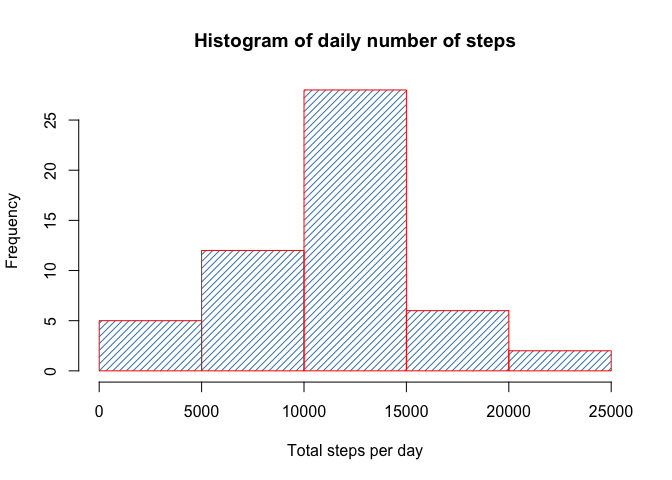
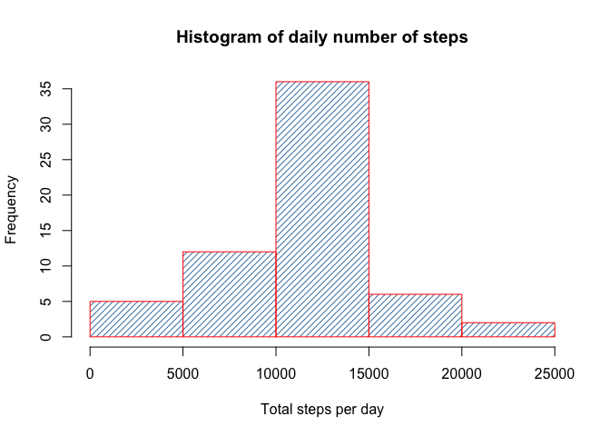
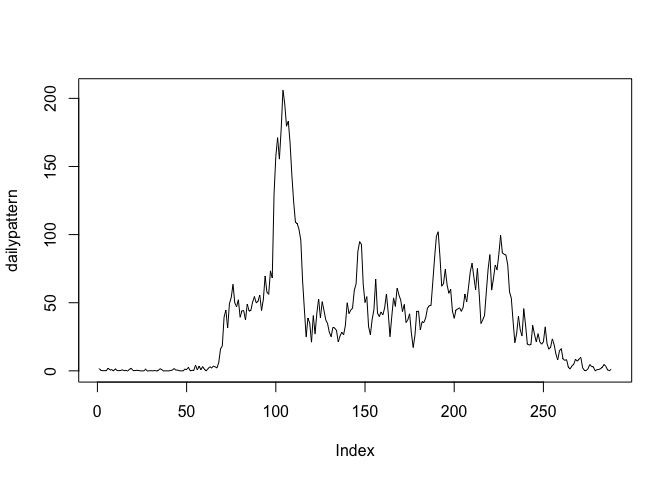

# Reproducible Research: Peer Assessment 1


## Loading ans preprocessing the data


```r
# 1 Loading the data
setwd("~/Dropbox/Datascience/Universite_Johns-Hopkins/Recherche_reproductible/RepData_PeerAssessment1")
activity <- read.csv("activity.csv")

# 2 Procees data
# convertion of interval and date in POSIXct
activity$time <- as.character(activity$interval)
activity$timemissingcar <- 4-nchar(activity$time)

for (i in 1:nrow(activity)) {
        if (activity$timemissingcar[i] == 1) {
                activity$time[i] <- paste("0",activity$time[i],sep = "")  
        } else if (activity$timemissingcar[i] == 2) {
                activity$time[i] <- paste("0","0",activity$time[i],sep = "")
        } else if (activity$timemissingcar[i] == 3) {
                activity$time[i] <- paste("0","0","0",activity$time[i],sep = "")
        } 
}

activity$datetime <- paste(as.POSIXct(activity$date),activity$time)
activity$datetime <- strptime(activity$datetime, "%Y-%m-%d %H%M")
activity <- activity[, - c(4:5)]

# Creation of a dataset without missing values
# 8 full days are missing
activity.complete <- activity[complete.cases(activity$steps),]

head(activity)
```

```
##   steps       date interval            datetime
## 1    NA 2012-10-01        0 2012-10-01 00:00:00
## 2    NA 2012-10-01        5 2012-10-01 00:05:00
## 3    NA 2012-10-01       10 2012-10-01 00:10:00
## 4    NA 2012-10-01       15 2012-10-01 00:15:00
## 5    NA 2012-10-01       20 2012-10-01 00:20:00
## 6    NA 2012-10-01       25 2012-10-01 00:25:00
```

```r
head(activity.complete)
```

```
##     steps       date interval            datetime
## 289     0 2012-10-02        0 2012-10-02 00:00:00
## 290     0 2012-10-02        5 2012-10-02 00:05:00
## 291     0 2012-10-02       10 2012-10-02 00:10:00
## 292     0 2012-10-02       15 2012-10-02 00:15:00
## 293     0 2012-10-02       20 2012-10-02 00:20:00
## 294     0 2012-10-02       25 2012-10-02 00:25:00
```


## What is mean total number of steps taken per day?


```r
# 1 total number of steps taken per day
tapply(activity.complete$steps,activity.complete$date,sum)
```

```
## 2012-10-01 2012-10-02 2012-10-03 2012-10-04 2012-10-05 2012-10-06 
##         NA        126      11352      12116      13294      15420 
## 2012-10-07 2012-10-08 2012-10-09 2012-10-10 2012-10-11 2012-10-12 
##      11015         NA      12811       9900      10304      17382 
## 2012-10-13 2012-10-14 2012-10-15 2012-10-16 2012-10-17 2012-10-18 
##      12426      15098      10139      15084      13452      10056 
## 2012-10-19 2012-10-20 2012-10-21 2012-10-22 2012-10-23 2012-10-24 
##      11829      10395       8821      13460       8918       8355 
## 2012-10-25 2012-10-26 2012-10-27 2012-10-28 2012-10-29 2012-10-30 
##       2492       6778      10119      11458       5018       9819 
## 2012-10-31 2012-11-01 2012-11-02 2012-11-03 2012-11-04 2012-11-05 
##      15414         NA      10600      10571         NA      10439 
## 2012-11-06 2012-11-07 2012-11-08 2012-11-09 2012-11-10 2012-11-11 
##       8334      12883       3219         NA         NA      12608 
## 2012-11-12 2012-11-13 2012-11-14 2012-11-15 2012-11-16 2012-11-17 
##      10765       7336         NA         41       5441      14339 
## 2012-11-18 2012-11-19 2012-11-20 2012-11-21 2012-11-22 2012-11-23 
##      15110       8841       4472      12787      20427      21194 
## 2012-11-24 2012-11-25 2012-11-26 2012-11-27 2012-11-28 2012-11-29 
##      14478      11834      11162      13646      10183       7047 
## 2012-11-30 
##         NA
```

```r
# 2 histogram of the total number of steps taken each day
tspd <- tapply(activity.complete$steps,activity.complete$date,sum)
hist(tspd, main = "Histogram of daily number of steps", density = 20,
     xlab = "Total steps per day", col = "steelblue", border = "red")
```

 

```r
# 3 mean and median of the total number of steps taken per day
mean(tspd, na.rm = TRUE)
```

```
## [1] 10766.19
```

```r
median(tspd, na.rm = TRUE)
```

```
## [1] 10765
```


## What is the average daily activity pattern?

```r
# 1 time series plot
# Let's use activity.complete to exclude missing values
dailypattern <- tapply(activity.complete$steps,activity.complete$interval,mean)
plot(dailypattern, type = 'l')
```

 

```r
# Index is corresponding the the 5' series : 288 * 5' every days
# ...we discover that people usually do not move when they spleep...

# 2 Which 5-minute interval, 
# on average across all the days in the dataset, 
# contains the maximum number of steps?
which.max(dailypattern)
```

```
## 835 
## 104
```

```r
# 08:35 in the morning 104 steps in average...
# Going to work in the morning
```


## Imputing missing values


```r
# 1 Number of missing values in the dataset
sum(is.na(activity$steps))
```

```
## [1] 2304
```

```r
# 2 & 3 Filling NA using the mean of the corresponding 5' interval in a new dataset
newactivity <- activity
for (i in 1:nrow(newactivity)) {
        if (is.na(newactivity$steps[i])) {
                newactivity$steps[i] <- dailypattern[as.character(newactivity$interval[i])]
        }
}
head(newactivity)
```

```
##       steps       date interval            datetime
## 1 1.7169811 2012-10-01        0 2012-10-01 00:00:00
## 2 0.3396226 2012-10-01        5 2012-10-01 00:05:00
## 3 0.1320755 2012-10-01       10 2012-10-01 00:10:00
## 4 0.1509434 2012-10-01       15 2012-10-01 00:15:00
## 5 0.0754717 2012-10-01       20 2012-10-01 00:20:00
## 6 2.0943396 2012-10-01       25 2012-10-01 00:25:00
```

```r
# 4 histogram of the total number of steps taken each day
tapply(newactivity$steps,newactivity$date,sum)
```

```
## 2012-10-01 2012-10-02 2012-10-03 2012-10-04 2012-10-05 2012-10-06 
##   10766.19     126.00   11352.00   12116.00   13294.00   15420.00 
## 2012-10-07 2012-10-08 2012-10-09 2012-10-10 2012-10-11 2012-10-12 
##   11015.00   10766.19   12811.00    9900.00   10304.00   17382.00 
## 2012-10-13 2012-10-14 2012-10-15 2012-10-16 2012-10-17 2012-10-18 
##   12426.00   15098.00   10139.00   15084.00   13452.00   10056.00 
## 2012-10-19 2012-10-20 2012-10-21 2012-10-22 2012-10-23 2012-10-24 
##   11829.00   10395.00    8821.00   13460.00    8918.00    8355.00 
## 2012-10-25 2012-10-26 2012-10-27 2012-10-28 2012-10-29 2012-10-30 
##    2492.00    6778.00   10119.00   11458.00    5018.00    9819.00 
## 2012-10-31 2012-11-01 2012-11-02 2012-11-03 2012-11-04 2012-11-05 
##   15414.00   10766.19   10600.00   10571.00   10766.19   10439.00 
## 2012-11-06 2012-11-07 2012-11-08 2012-11-09 2012-11-10 2012-11-11 
##    8334.00   12883.00    3219.00   10766.19   10766.19   12608.00 
## 2012-11-12 2012-11-13 2012-11-14 2012-11-15 2012-11-16 2012-11-17 
##   10765.00    7336.00   10766.19      41.00    5441.00   14339.00 
## 2012-11-18 2012-11-19 2012-11-20 2012-11-21 2012-11-22 2012-11-23 
##   15110.00    8841.00    4472.00   12787.00   20427.00   21194.00 
## 2012-11-24 2012-11-25 2012-11-26 2012-11-27 2012-11-28 2012-11-29 
##   14478.00   11834.00   11162.00   13646.00   10183.00    7047.00 
## 2012-11-30 
##   10766.19
```

```r
newtspd <- tapply(newactivity$steps,newactivity$date,sum)
hist(newtspd, main = "Histogram of daily number of steps", density = 20,
     xlab = "Total steps per day", col = "steelblue", border = "red")
```

 

```r
mean(newtspd)
```

```
## [1] 10766.19
```

```r
median(newtspd)
```

```
## [1] 10766.19
```

```r
# Impact of imputing missing data on the estimates of the total daily number of steps:
# No impact on mean as missing values are 8 full days and are filled using mean ...
# Nevertheless the distribution is impacted by reduction of standard variance
# (more days are close to the mean!)
```


## Are there differences in activity patterns between weekdays and weekends?


```r
# 1 Creating new factor variable weekday/weekend
newactivity$weekday <- "weekday"
for (i in 1:nrow(newactivity)) {
        if ((weekdays(newactivity$datetime[i]) == "Samedi") | (weekdays(newactivity$datetime[i]) == "Dimanche")) {
                newactivity$weekday[i] <- "weekend"
        }
}
newactivity$weekday <- as.factor(newactivity$weekday)
str(newactivity)
```

```
## 'data.frame':	17568 obs. of  5 variables:
##  $ steps   : num  1.717 0.3396 0.1321 0.1509 0.0755 ...
##  $ date    : Factor w/ 61 levels "2012-10-01","2012-10-02",..: 1 1 1 1 1 1 1 1 1 1 ...
##  $ interval: int  0 5 10 15 20 25 30 35 40 45 ...
##  $ datetime: POSIXlt, format: "2012-10-01 00:00:00" "2012-10-01 00:05:00" ...
##  $ weekday : Factor w/ 2 levels "weekday","weekend": 1 1 1 1 1 1 1 1 1 1 ...
```

```r
# 2 panel plot weekday/weekend
newactivityweekday <- newactivity[newactivity$weekday == "weekday",]
newactivityweekend <- newactivity[newactivity$weekday == "weekend",]

dailypatternweekday <- tapply(newactivityweekday$steps,newactivityweekday$interval,mean)
dailypatternweekend <- tapply(newactivityweekend$steps,newactivityweekend$interval,mean)

par(mfrow = c(2,1), mar = c(4.1,4.1,4.1,2.1)) #  initialiser

plot(dailypatternweekday, type = 'l', main = "Weekday")
plot(dailypatternweekend, type = 'l', main = "Weekend")
```

 

```r
# Activity is more spread over the day during weekends
```


